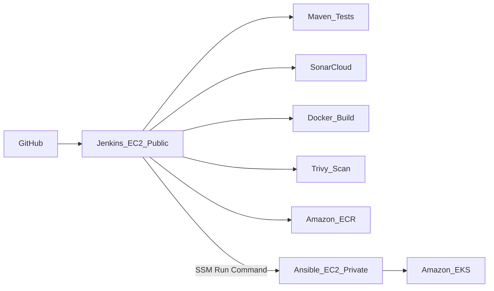

# Jenkins to Kubernetes CI/CD on AWS

Enterprise-style CI/CD portfolio project on AWS.

**Current phase: Jenkins only**

Right now Terraform deploys the Project 1-style VPC plus a Jenkins EC2 host with Java, Maven, Docker, Git, and core Jenkins pipeline plugins. SonarCloud, ECR, Ansible EC2, and EKS come in later phases.

**Full target pipeline:** GitHub → Jenkins (Maven, SonarCloud, Docker, Trivy, ECR) → Ansible EC2 → EKS

## Architecture



### Network foundation

VPC layout is **copied from Project 1** (`marisol-aws-three-tier-terraform`):

| Tier | Subnets | Used by |
|------|---------|---------|
| Public | 2 AZs | NAT, Jenkins EC2 |
| Private app | 2 AZs | Ansible EC2, EKS nodes |
| Private DB | 2 AZs | Kept for continuity (no RDS in this project) |

### Why Jenkins and Ansible are separate

| Host | Responsibility |
|------|----------------|
| **Jenkins EC2** | CI: compile, unit tests, Sonar quality gate, Docker build, Trivy scan, ECR push |
| **Ansible EC2** | CD: authenticate to EKS, apply manifests, wait for rollout, rollback |

This matches a common enterprise pattern: **build is separated from deploy**, with different IAM permissions on each host.

## Repository layout

```text
.
├── .github/workflows/
│   ├── terraform-checks.yml
│   ├── terraform-deploy.yml
│   └── devsecops.yml
├── Jenkinsfile
├── app/                 # Spring Boot sample application
├── ansible/             # deploy.yml and rollback.yml
├── k8s/                 # Namespace, Deployment, Service
└── terraform/
    ├── modules/vpc/     # Copied from Project 1
    ├── modules/security/
    ├── modules/jenkins/
    ├── modules/ansible/
    ├── modules/ecr/
    └── modules/eks/
```

## CI/CD (GitHub Actions)

- **Pull requests (`terraform-checks.yml`):** Terraform `fmt`, `init -backend=false`, `validate`
- **PRs and pushes to main (`devsecops.yml`):** Gitleaks secret scan + Checkov IaC scan
- **Manual deploy (`terraform-deploy.yml`):** `workflow_dispatch` runs Terraform init/validate/plan/apply

App build/deploy stays in Jenkins for this project. Terraform AWS apply is manual via GitHub Actions so you control when infrastructure (and cost) is created.

Required GitHub secrets:

- `AWS_ACCESS_KEY`
- `AWS_SECRET_ACCESS_KEY`

## Prerequisites

- Terraform >= 1.10
- AWS CLI configured
- S3 backend bucket `marisol-terraform-state-12345` (same as other portfolio projects)
- SonarCloud account + token stored in Jenkins as credential `sonar-token`
- GitHub repo access for Jenkins and Ansible hosts

## Quick start

```bash
cd terraform
cp terraform.tfvars.example terraform.tfvars
terraform init
terraform plan
terraform apply
```

Useful outputs:

```bash
terraform output jenkins_url
terraform output jenkins_instance_id
terraform output ansible_instance_id
terraform output ecr_repository_url
terraform output eks_cluster_name
```

### Access Jenkins

1. Open `terraform output -raw jenkins_url`
2. Or use SSM: `aws ssm start-session --target $(terraform output -raw jenkins_instance_id)`
3. Get initial admin password from `/var/lib/jenkins/secrets/initialAdminPassword` on the Jenkins host

### Configure the pipeline job

1. Create a Pipeline job pointing at this repository’s `Jenkinsfile`
2. Set parameters:
   - `ECR_REPOSITORY_URL` = terraform output `ecr_repository_url`
   - `ANSIBLE_INSTANCE_ID` = terraform output `ansible_instance_id`
   - `AWS_REGION` = `us-east-1`
3. Add Jenkins credential ID `sonar-token` (Secret text)

### Manual rollback

From the Ansible host (SSM session):

```bash
cd /opt/ansible/repo
ansible-playbook ansible/rollback.yml
```

## Security notes

- No SSH from the internet; SSM Session Manager for admin access
- Jenkins can SSH to Ansible SG only (optional handoff path); primary deploy path is SSM Run Command
- Jenkins IAM can push to ECR and send SSM commands to Ansible
- Ansible IAM can access EKS (via EKS access entry) and pull images
- Trivy fails the pipeline on HIGH/CRITICAL findings
- SonarCloud quality analysis runs before image publish

## Cost estimate (lab)

| Resource | Approx. |
|----------|---------|
| EKS control plane | ~$0.10/hr |
| EKS nodes (2x t3.small) | ~$0.04/hr |
| Jenkins t3.xlarge | ~$0.17/hr |
| Ansible t3.small | ~$0.02/hr |
| NAT Gateway | ~$0.045/hr |
| **Total** | **~$0.38/hr** |

Destroy when finished:

```bash
cd terraform
terraform destroy
```

## Interview talking points

- Project 1 VPC reused as networking foundation for a CI/CD platform
- Jenkins vs Ansible host separation (CI vs CD)
- Declarative Jenkins pipeline stages and quality gates
- Trivy and SonarCloud shift-left security
- EKS deploy and `kubectl rollout undo` rollback
- IAM least privilege between build and deploy hosts

## Production improvements

- Private Jenkins behind an ALB with authentication
- GitHub webhooks / multibranch pipeline
- IRSA for Kubernetes workloads
- GitOps (Argo CD) as a later evolution (Project 5)
- Multi-AZ NAT and larger EKS node groups for HA
